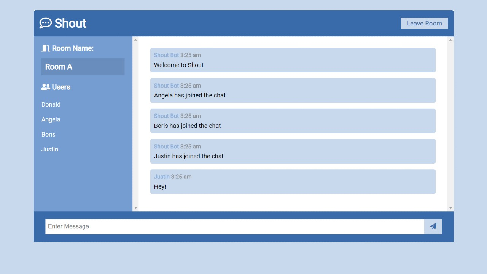

# Shout - Chat App

A chat/instant messaging app built with [socket.io](https://socket.io/).



## Setup

To clone and run this application, you'll need [Git](https://git-scm.com/) and [Node.js](https://nodejs.org/) (which comes with [npm](https://www.npmjs.com/)) installed on your computer. From your command line:

```sh
# Clone this repository
$ git clone https://github.com/andyrutherford/shout-chat-app.git

# Go into the repository
$ cd

# Install dependencies
$ npm install

# Run the app
$ npm run dev
```

## Tech

COVID19-Tracker uses a number of open source projects to work properly:

- [node.js](http://nodejs.org) - evented I/O for the backend
- [Express](http://expressjs.com) - fast node.js network app framework
- [socket.io](https://socket.io/) - enables real-time bidirectional event-based communication

## Demo

Here is a working live demo : https://shout-app2471.herokuapp.com/

## License

MIT
